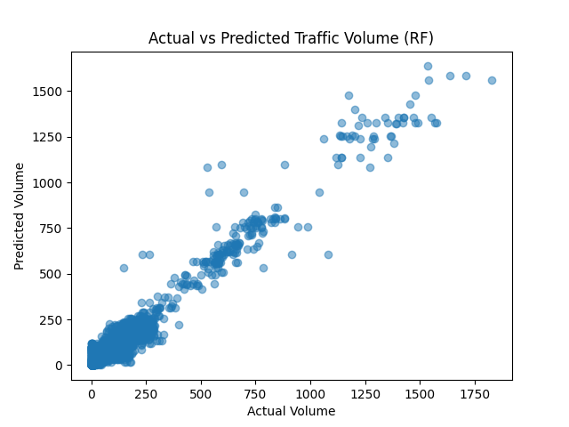

# New York City Traffic Volume Prediction 🚦

This project predicts hourly traffic volume in Boston using time-based and location-based features. It showcases data cleaning, feature engineering, exploratory visualization, and machine learning model building — all within a real-world context. The model ultimately achieved an **R² score of 0.95** using a Random Forest Regressor.

---

## 🧼 Data Cleaning & Preprocessing

The dataset originally contained **over 1.7 million rows** across multiple years. To streamline the analysis and focus on the most recent trends:

1. **Filtered to 2024 rows only** using Excel (prior to import)
2. **Dropped all rows with missing values** using `pandas.dropna()` in Python
3. Selected relevant columns:  
   `['Boro', 'Yr', 'M', 'D', 'HH', 'street', 'Vol', 'Direction']`

These steps ensured a clean, focused dataset ready for feature engineering and modeling.

---

## 📊 Exploratory Data Analysis

Using `matplotlib` and `seaborn`, the following insights were visualized:

- **Top 10 busiest streets** by total traffic volume
- **Busiest hours** of the day
- **Weekly traffic patterns** across weekdays
- Volume distribution visualized through bar charts and summary statistics

---

## 🧠 Feature Engineering

New features were created to better represent the data:

- `weekday_num`: Numerical representation of the day of the week (0 = Monday)
- `boro_num`: Encoded borough names to numeric values (0–4)
- `street_num`: Top 50 streets were mapped to integers (0–49); others were excluded to reduce noise
- `Time`: Converted from 24-hour format to 12-hour AM/PM format for visualization

These features allowed the model to account for time and location-based traffic trends.

---

## 🤖 Machine Learning Models

### Linear Regression

- **Goal**: Establish a baseline
- **Result**:  
  - R² Score: ~0.02  
  - MSE: ~18,000  
- **Limitation**: Underfit the data and could not capture nonlinear spikes (e.g. rush hour)

### Random Forest Regressor

- **Goal**: Model complex, nonlinear traffic patterns using an ensemble approach
- **Result**:  
  - R² Score: **0.95**  
  - MSE: **~944**
- **Why it worked**: Random Forest can capture complex relationships across categorical + numeric variables, like `street_num` and `HH`.

---

## 📈 Model Performance

This scatter plot demonstrates how closely the Random Forest model predictions match actual traffic volumes.

---

## 🔧 Tools & Libraries

- Python 3
- pandas, numpy
- matplotlib, seaborn
- scikit-learn (for modeling and evaluation)

---

## 💡 Future Improvements

- Deploy a Flask or FastAPI **prediction API**
- Integrate with real-time data from public APIs (e.g., TomTom, HERE)
- Build an interactive frontend using **Streamlit**
- Expand the feature set to include weather or events

---

## 📄 License

This project is provided under the MIT License and is intended for educational and portfolio use.

---

## 🙋‍♂️ About Me

I'm an aspiring data analyst focused on solving real-world problems with clean data pipelines and strong visual storytelling. I built this project to demonstrate my ability to clean, analyze, model, and explain complex datasets clearly.

Feel free to connect or reach out!
